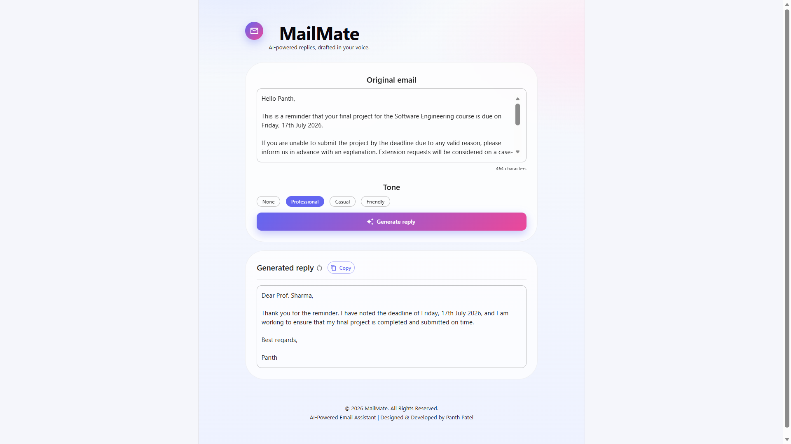
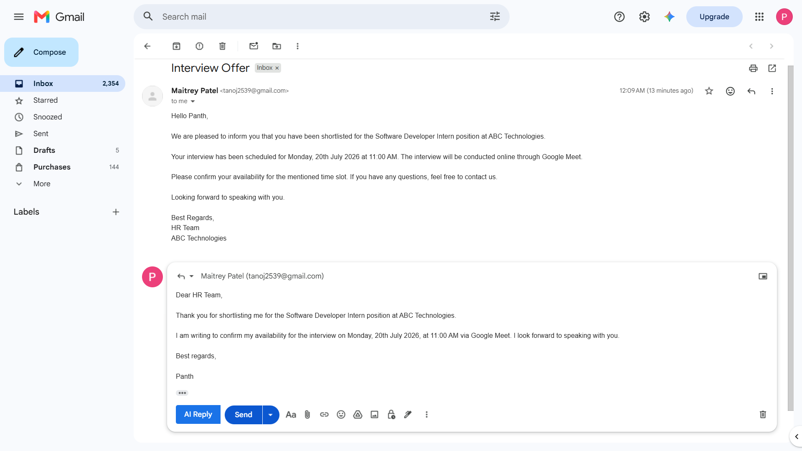

# 📧 MailMate

An AI-powered email assistant that generates context-aware email replies using Google Gemini AI. MailMate is available as both a modern web application and a Chrome Extension that integrates directly with Gmail, allowing users to generate professional email replies with a single click.

---

## ✨ Features

- 🤖 AI-powered email reply generation
- 💬 Multiple reply tones (Professional, Friendly & Casual)
- 🌐 Gmail Chrome Extension integration
- 📋 One-click copy generated reply
- ⚡ Fast REST API powered by Spring Boot
- 🎨 Modern, responsive Material UI interface

---

## 🛠️ Tech Stack

### Frontend
- React.js
- Vite
- Material UI
- Axios

### Backend
- Java
- Spring Boot
- REST API

### AI
- Google Gemini AI API

---

## 📸 Screenshots

### MailMate Web Application



### Gmail Chrome Extension



---

## 🌐 Chrome Extension

MailMate includes a Chrome Extension that integrates directly with Gmail.

Users can generate AI-powered email replies inside the Gmail compose window with a single click, making email communication faster, smarter, and more efficient.

---

## 🏗️ Project Architecture

```text
React (Vite)
      │
      ▼
Spring Boot REST API
      │
      ▼
Google Gemini AI API
```

---

## 🚀 Installation

### Clone Repository

```bash
git clone https://github.com/Panth009/MailMate.git
```

### Frontend

```bash
cd MailMate-Frontend
npm install
npm run dev
```

### Backend

```bash
cd email/email
mvn spring-boot:run
```

---

## 🔑 Environment Variables

Create an `.env` file and add:

```env
GEMINI_API_KEY=YOUR_GEMINI_API_KEY
```

---

## 🌐 Chrome Extension Setup

1. Open Google Chrome.
2. Go to `chrome://extensions`.
3. Enable **Developer Mode**.
4. Click **Load unpacked**.
5. Select the **MailMate-Extension** folder.
6. Open Gmail and click the **AI Reply** button inside the compose window.

---

## 👨‍💻 Author

**Panth Patel**

Computer Science & Engineering (Data Science)

GitHub: https://github.com/Panth009

---

⭐ If you found this project useful, consider giving it a star!
